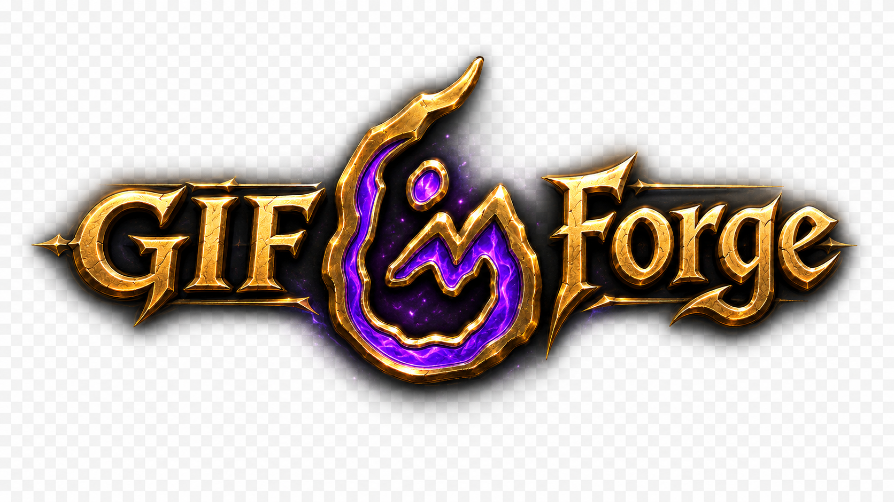

<div align="center">



### Modern Linux screen-capture studio — record, edit on a timeline, export an optimized GIF, WebM or APNG

[](https://github.com/elhombretecla/gif-forge/actions/workflows/ci.yml)
[](https://github.com/elhombretecla/gif-forge/releases)
[](LICENSE)

</div>

**GIF Forge** records a region, window or full screen on **Wayland or X11**, then
lets you refine the result on a **timeline** (trim, cut, reorder, retime, crop,
add captions, undo/redo) before exporting an optimized **GIF, WebM or APNG**.
Projects are saveable and survive crashes. It is built in **Python + GTK4 /
Libadwaita**.

- 📖 **User guide:** [`docs/USER_GUIDE.md`](docs/USER_GUIDE.md)
- 🛠️ **Development & build:** [`docs/DEVELOPMENT.md`](docs/DEVELOPMENT.md)
- 📦 **Packaging & releases:** [`docs/PACKAGING.md`](docs/PACKAGING.md)
- 🤖 **Working with AI agents:** [`AGENTS.md`](AGENTS.md)

## Features

- 🎥 **Capture** a region, window or the whole screen on **Wayland** (ScreenCast
  portal + PipeWire) or **X11** (ffmpeg `x11grab`).
- ✂️ **Timeline editor** — trim, cut, reorder, duplicate, retime, change speed,
  remove duplicate frames, and add text captions, all with undo/redo.
- 💾 **Export** to optimized **GIF** (optionally via `gifski` for higher
  quality), **WebM** (VP9) or **APNG**.
- 🗂️ **Projects** — save your work as a `.gifforge` file; autosave recovers
  unsaved recordings after a crash.
- 🌍 **Localized UI** — English, Spanish, French, German and Portuguese
  (switchable in Preferences).
- 🎨 Native GNOME look with light/dark theme support (Libadwaita).

## Installation

| Method | Audience | How | Notes |
|---|---|---|---|
| **Flatpak** *(recommended)* | Any distro, best Wayland support | Download `gif-forge.flatpak` from [Releases](https://github.com/elhombretecla/gif-forge/releases), then `flatpak install --user gif-forge.flatpak` | Sandboxed; bundles ffmpeg + gifski |
| **AppImage** | Portable, no install | Download the `.AppImage` from Releases, `chmod +x`, run it | X11 capture reliable; Wayland best-effort |
| **`.deb`** | Ubuntu 22.04+ / Debian 12+ | Download from Releases, then `sudo apt install ./gif-forge_*.deb` | Uses system GTK4 / ffmpeg |
| **Arch (AUR)** | Arch / Manjaro | `yay -S gif-forge` | From the AUR |
| **Fedora (COPR)** | Fedora | `sudo dnf copr enable <owner>/gif-forge && sudo dnf install gif-forge` | Needs [RPM Fusion](https://rpmfusion.org/) for `ffmpeg` |
| **From source** | Developers | `./run.sh` or `python3 -m gifforge` | See [Development](#development) |

### From source

```sh
# Runtime dependencies on Debian/Ubuntu:
sudo apt install python3-gi python3-gi-cairo gir1.2-gtk-4.0 gir1.2-adw-1 \
    gstreamer1.0-pipewire gstreamer1.0-plugins-good ffmpeg
# (optional, for higher-quality GIFs) gifski

# Run straight from a checkout — run.sh checks deps and compiles schema + translations:
./run.sh
# or:
python3 -m gifforge
```

## Usage

1. **Launch GIF Forge.** A near-transparent **capture frame** appears together
   with a floating **control bar**.
2. **Frame your capture.** Drag and resize the capture frame over what you want
   to record, or type an exact size (in pixels) in the control bar.
3. **Pick a format** (GIF / WebM / APNG) from the control bar dropdown.
4. **Press Record.** After an optional countdown, recording starts; press
   **Stop** when you're done.
5. **Edit** (default) — the **timeline editor** opens with your frames. Select
   frames and trim, cut, duplicate, reorder, change speed/delay, or add a
   caption; preview with play/loop. Everything is undoable (`Ctrl+Z` /
   `Ctrl+Shift+Z`).
6. **Export** — click **Export…**, choose a preset and destination. (If you turn
   off *“Open editor after recording”* in Preferences, recordings are saved
   straight away instead.)

**Preferences** (`Ctrl+,`): output format, frame rate, downsampling, capture
mouse/sound, start delay, gifski quality, **language**, and dark-theme
preference. **Toggle recording** from anywhere with `Ctrl+Alt+R`.

> On **Wayland**, screen capture goes through the desktop's ScreenCast portal
> (you'll be asked to pick what to share). On **X11**, the capture frame's area
> is recorded directly.

## How it works

GIF Forge is a **Python 3.10+** application built on **GTK4 + Libadwaita** via
PyGObject. The codebase is intentionally layered, with the domain logic kept
free of any GTK dependency so it can be unit-tested headlessly:

| Layer | Responsibility | Key tech |
|---|---|---|
| **Capture** | Region/window/screen capture | ScreenCast portal + **PipeWire** (`pipewiresrc`) on Wayland; **ffmpeg `x11grab`** on X11 |
| **Encode** | Recording & edited-timeline export | **ffmpeg** (VP9/GIF/APNG, `palettegen`/`paletteuse`), optional **gifski** |
| **Frames** | Decode → disk-backed frame list, per-frame ops | ffmpeg, **pycairo** (caption/overlay rendering) |
| **Editor** | Timeline + undoable edit commands | snapshot-based undo/redo |
| **Project** | `.gifforge` container, recents, autosave/recovery | — |
| **Settings** | Preferences | **GSettings** (dconf), JSON fallback |
| **UI** | Recorder, editor, preview, export, preferences windows | GTK4 / Libadwaita |

Capture backends sit behind a small factory that auto-detects Wayland vs X11.
The domain layers (`capture`, `encode`, `frames`, `editor`, `project`, `models`)
never import GTK. See [`docs/DEVELOPMENT.md`](docs/DEVELOPMENT.md) for the full
architecture and [`AGENTS.md`](AGENTS.md) for contributor/agent conventions.

## Development

```sh
# Run from source
./run.sh

# Unit tests
python3 -m pytest tests_py -q

# End-to-end UI drivers (need a display; use Xvfb headless)
xvfb-run -a python3 tests_py/_e2e_editor.py

# Build the Flatpak
flatpak-builder --user --install --force-clean build \
    build-aux/flatpak/io.github.elhombretecla.GifForge.yml
```

Full guides: [`docs/DEVELOPMENT.md`](docs/DEVELOPMENT.md) (build & architecture)
and [`docs/PACKAGING.md`](docs/PACKAGING.md) (all distribution channels).

## Contributing

Contributions are very welcome! 🎉 Whether it's a bug report, a feature, docs, or
a translation, here's how to get started:

- Read [`AGENTS.md`](AGENTS.md) for the project conventions (layered
  architecture, code style, i18n rules, boundaries) — it's written for both
  humans and AI agents.
- Open an issue to discuss larger changes first; keep pull requests small and
  focused, and make sure CI is green.
- **Good first contributions:**
  - 🌐 **Translations** — French, German and Portuguese are machine-drafted and
    need a native-speaker review; adding a new language is easy too. See
    [`po/AGENTS.md`](po/AGENTS.md).
  - 🐛 Reproducing and fixing bugs filed in the issue tracker.
  - 📝 Improving the user guide and documentation.

## License

GIF Forge is free software, released under the
[GNU General Public License v3.0 or later](LICENSE).

Copyright © 2026 Juan de la Cruz García.

## Credits

GIF Forge began as a ground-up rewrite of
[**Peek**](https://github.com/phw/peek), the screen recorder by Philipp Wolfer,
which was [deprecated in 2024](https://github.com/phw/peek/issues/1191). GIF
Forge is an independent project — built from scratch in Python/GTK4 rather than
Peek's original Vala/GTK3 — but it builds on Peek's packaging and ffmpeg/gifski
encoding knowledge under the same GPL-3.0-or-later license. See
[`AUTHORS`](AUTHORS) for full attribution.
